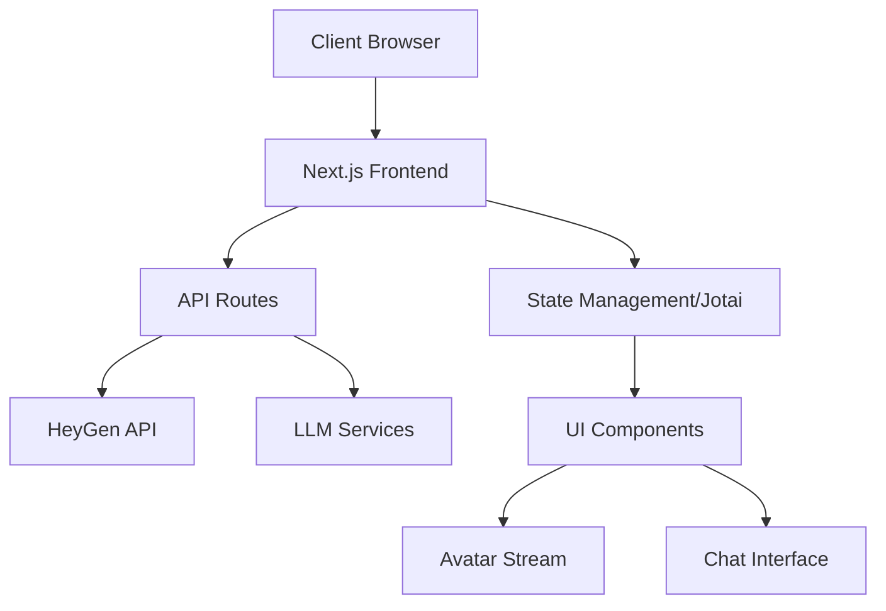

# Interactive Avatar App


## Overview

This project showcases the implementation of HeyGen's [Interactive Streaming Avatar](https://docs.heygen.com/docs/streaming-api) service in a Next.js application. It serves as both a demonstration and a starting point for building advanced avatar-based interactive applications.

https://github.com/agmmnn/streaming-avatar-playground/assets/16024979/76c08640-189d-4354-a1b7-397b80d2f197

## Features

### Implemented

- **Background Removal:** Real-time green screen background removal
- **Screenshot Capture:** Instant frame capture functionality
- **Video Recording:** Stream recording with download capability
- **Custom Background:** Support for custom image/video backgrounds

### Coming Soon

- **Multiple LLM Support:** Integration with various AI models
- **Speech-to-Text:** Real-time speech transcription
- **Interactive Chatbox:** Enhanced communication interface
- **Conversation History:** Persistent chat storage and retrieval

## Tech Stack

- **Frontend:** Next.js 15, React 18, TS
- **Styling:** shadcn/ui, Tailwind CSS
- **State Management:** Jotai
- **AI Integration:** Vercel AI SDK (@ai-sdk/\*)
- **Avatar Service:** HeyGen Interactive/Streaming Avatar
- **Package Manager:** Bun
https://api.heygen.com/v1/streaming/avatar.list


## Architecture



## Project Structure

```
interactive-avatar-playground/
├── app/
│   ├── api/
│   │   └── chat/
│   │       └── route.ts
│   ├── components/
│   │   ├── avatar/
│   │   ├── chat/
│   │   └── ui/
│   ├── lib/
│   │   └── utils.ts
│   ├── store/
│   │   └── atoms.ts
│   ├── layout.tsx
│   └── page.tsx
├── public/
│   └── assets/
├── styles/
│   └── globals.css
├── types/
│   └── index.ts
└── package.json
```

## Getting Started

1. Clone the repository:

```bash
git clone https://github.com/diyakamboj/snap-dragon-hackathon.git
cd snap-dragon-hackathon
```


2. Install dependencies:

```bash
npm install
```

3. Create environment file:

```bash
cp .env.example .env
```

4. Update environment variables in `.env`:

```env
# Required API keys and configurations
HEYGEN_API_KEY=your_api_key_here
```

5. Start development server:

```bash
npm run dev
```

6. Build for production:

```bash
npm run build
```

7. Start production server:

```bash
npm start
```

8. Open [http://localhost:3000](http://localhost:3000) in your browser

## Configuration

The project uses environment variables for configuration. Copy `.env.example` to `.env` and update the values:

```env
# Required API keys and configurations
HEYGEN_API_KEY=your_api_key_here
```

## Learn More

- [Next.js Documentation](https://nextjs.org/docs)
- [HeyGen API Documentation](https://docs.heygen.com/)
- [shadcn/ui](https://ui.shadcn.com/), [Tailwind CSS](https://tailwindcss.com/docs)

## Deployment

Deploy easily on [Vercel](https://vercel.com/new?utm_medium=default-template&filter=next.js&utm_source=create-next-app&utm_campaign=create-next-app-readme), the platform from Next.js creators.

## License

Portions of this code are copyright of their respective authors and released
under the MIT license:
- (https://github.com/agmmnn/interactive-avatar-playground/) - agmmnn

---

Built with using Next.js and HeyGen
